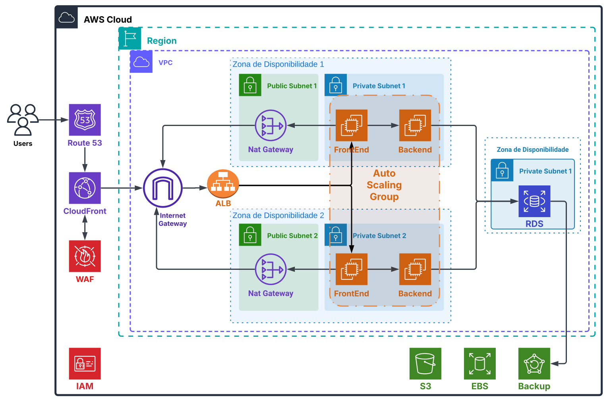

# Migração para AWS: Proposta Técnica e Comercial

**Cliente:** Fast Engineering S/A

**Autores:**

- *Gabriel do Nascimento Gomes*
- *Isabela do Amaral Leite Ferreira*
- *Lucas Becker Barbosa Lima*

---

Esta proposta tem como objetivo demonstrar como a migração da infraestrutura on-premises para a AWS resolverá os desafios atuais do E-commerce da Fast Engineering S/A, agregando robustez, escalabilidade, segurança e redução de custos. A transição será realizada em duas etapas: uma inicial de Lift-and-Shift e, em seguida, a modernização com Kubernetes (EKS).

---

## 0. Índice

0. [Índice](#índice)
1. [Contexto do Projeto](#contexto-do-projeto)
2. [Atividades Necessárias para a Migração](#atividades-necessárias-para-a-migração)
3. [Ferramentas Utilizadas](#ferramentas-utilizadas)
4. [Diagrama da Infraestrutura na AWS](#diagrama-da-infraestrutura-na-aws)
5. [Garantia dos Requisitos de Segurança](#garantia-dos-requisitos-de-segurança)
6. [Processo de Backup](#processo-de-backup)
7. [Custo da Infraestrutura na AWS (AWS Calculator)](#custo-da-infraestrutura-na-aws-aws-calculator)
8. [Conclusão](#conclusão)

---

## 1. Contexto do Projeto

A infraestrutura atual da Fast Engineering S/A apresenta limitações críticas:

- **Banco de Dados MySQL:** Servidor único com 500GB de dados e 10GB de RAM, sem redundância nem backups automatizados.
- **Aplicação Monolítica e Fragmentada:** Frontend em React, backend composto por múltiplas APIs e Nginx atuando como balanceador de carga e servidor de arquivos estáticos.
- **Escalabilidade Limitada:** A arquitetura atual não acompanha os picos de tráfego, impactando desempenho e disponibilidade.

A migração para a AWS trará benefícios essenciais, como alta disponibilidade, escalabilidade sob demanda, segurança reforçada e otimização de custos com o modelo pay-as-you-go.

---

## 2. Atividades Necessárias para a Migração

### Etapa 1 – Lift-and-Shift (As-Is)

Para garantir a continuidade operacional, a migração inicial replica a infraestrutura atual na AWS com o mínimo de mudanças:

- **Preparação da AWS:**
    - Configuração da **VPC** com sub-redes públicas (para o frontend) e privadas (para backend e banco de dados).
    - Criação e configuração de **Grupos de Segurança** e **IAM Roles** para controle de acesso.
    - Estabelecimento de conexão segura entre o ambiente on-premises e a VPC (por meio de VPN).
- **Migração dos Componentes:**
    - **Banco de Dados:**
        - Uso do **AWS DMS** para migração do MySQL para o **Amazon RDS MySQL MultiAZ**.
        - **Instalação e configuração do agente DMS:** Certificar-se de que o agente DMS (quando necessário) esteja instalado e configurado corretamente para monitoramento e replicação dos dados.
        - Backup prévio do banco de dados (utilizando `mysqldump` e envio para o S3) para garantir a segurança dos dados durante a transição.
    - **Aplicação:**
        - Utilização do **AWS MGN** para replicação dos servidores de backend e frontend, mantendo-os operacionais e sincronizados.
        - Verificar a instalação dos agentes do AWS MGN nos servidores de origem para assegurar uma replicação fiel e contínua.
    - **Armazenamento:**
        - Transferência dos arquivos estáticos (imagens, vídeos, etc.) para o **Amazon S3**.
- **Testes e Validação:**
    - Verificação de conectividade, desempenho e funcionalidades em ambiente AWS.
- **Cutover:**
    - Atualização do DNS via **Route 53** para redirecionar o tráfego para os novos endpoints na AWS.

### Etapa 2 – Modernização com Kubernetes (EKS)

Nesta segunda fase, a infraestrutura será refatorada para uma arquitetura de microsserviços:

- **Containerização:**
    - Empacotamento do frontend, backend e APIs em containers Docker.
- **Orquestração:**
    - Implantação em cluster gerenciado pelo **Amazon EKS**, garantindo escalabilidade automática e isolamento de falhas.
    - **Instalação e configuração dos agentes do EKS:** Incluir a instalação dos componentes necessários (como o EKS Connector ou agentes de monitoramento e gestão de nós) para garantir a integração completa do cluster com a AWS e facilitar a administração e escalabilidade dos nós.
- **Comunicação e Monitoramento:**
    - Implementação de um **API Gateway** e, se necessário, uma camada de **Service Mesh** para gerenciar a comunicação entre serviços.
    - Monitoramento contínuo utilizando **CloudWatch**, **Prometheus** e **Grafana** para observabilidade e detecção de anomalias.

---

## 3. Ferramentas Utilizadas

Para assegurar a eficácia da migração e modernização, serão empregadas diversas ferramentas e serviços da AWS:

- **Migração e Replicação:**
    - **AWS DMS:** Migração do banco de dados.
    - **AWS MGN:** Replicação da aplicação.
- **Infraestrutura e Computação:**
    - **EC2:** Hospedagem do frontend e backend na etapa Lift-and-Shift.
    - **Amazon RDS:** Banco de dados MySQL com MultiAZ para alta disponibilidade.
    - **Amazon EKS:** Orquestração de containers para a modernização com Kubernetes.
- **Armazenamento:**
    - **Amazon S3:** Armazenamento de objetos (imagens, vídeos, arquivos estáticos).
- **Segurança e Monitoramento:**
    - **IAM:** Gestão de identidade e acesso com políticas de menor privilégio.
    - **WAF:** Proteção contra ataques web.
    - **CloudTrail e GuardDuty:** Monitoramento e auditoria de atividades.
    - **KMS:** Criptografia de dados em repouso e em trânsito (SSL/TLS).
- **Rede e Distribuição:**
    - **VPC, NAT Gateway:** Manter as máquinas não expostas livremente na rede.
    - **Route 53:** Estrutura para Roteamento e DNS:
    - **CloudFront:** Estrutura de rede segura e distribuição de conteúdo.

---

## 4. Diagrama da Infraestrutura na AWS

### Etapa 1 – Lift-and-Shift

- **Frontend:** Instâncias EC2 (tipo t4g.small) em sub-redes públicas.
- **Backend:** Instâncias EC2 (tipo t4g.medium) em sub-redes privadas.
- **Banco de Dados:** Amazon RDS MySQL (instância db.m6g.xlarge) com configuração Single-AZ.
- **Armazenamento:** Amazon S3 para arquivos estáticos.

**Diagrama de Migração:**

**Diagrama pós Migração:**

### Etapa 2 – Modernização com Kubernetes (EKS)

- **Cluster EKS:** Orquestração de containers Docker com escalabilidade automática.
- **Microsserviços:** Divisão dos componentes em serviços independentes (frontend, APIs, processamento de imagens).
- **Integração com RDS e ElastiCache:** Otimização de performance com cache em memória (Redis) e banco de dados redundante.

**Diagrama de Referência:**

---

## 5. Garantia dos Requisitos de Segurança

A segurança é garantida por meio de múltiplas camadas e controles:

- **Controle de Acesso:**
    - Configuração de **IAM** com políticas de mínimo privilégio.
    - Grupos de Segurança rigorosos e segmentação de rede via VPC.
- **Criptografia:**
    - Criptografia dos volumes EBS com KMS (AES-256).
    - Uso de SSL/TLS para comunicação segura entre clientes e serviços.
- **Monitoramento e Auditoria:**
    - **CloudTrail** para auditoria das atividades.
    - **GuardDuty** para detecção de ameaças e comportamentos suspeitos.
- **Proteção Perimetral:**
    - Implementação de **WAF** para filtrar tráfego malicioso.
    - Uso de **Route 53** e **CloudFront** para mitigar ataques de negação de serviço (DDoS).

---

## 6. Processo de Backup

Para assegurar a integridade dos dados e facilitar a recuperação em caso de falhas, o processo de backup será realizado da seguinte forma:

- **Banco de Dados:**
    - **Snapshots Diários:** Realizados no RDS e armazenados automaticamente.
    - **mysqldump:** Backup adicional do banco, com envio para o S3 utilizando versionamento.
- **Servidores e Aplicações:**
    - **Snapshots EBS:** Automatizados via AWS Backup, garantindo cópias dos volumes dos servidores.
    - **Backup de Arquivos Estáticos:** Imagens e arquivos armazenados no S3 com versionamento para proteção contra alterações indesejadas.

---

## 7. Custo da Infraestrutura na AWS (AWS Calculator)

A estimativa de custos, baseada em simulações e informações atuais da AWS é a seguinte:

### Etapa 1 – Lift-and-Shift

| Recurso                          | Especificação                                  | Custo Mensal Estimado (USD) |
| --------------------------------- | ---------------------------------------------- | --------------------------- |
| **EC2 Frontend**                  | t4g.small (2 vCPUs, 2 GiB)                    | ~$9.27                      |
| **EC2 Backend**                   | t4g.medium (2 vCPUs, 4 GiB)                   | ~$17.00                     |
| **RDS MySQL**                     | db.t4g.xlarge (16 GiB, Single-AZ)             | ~$193.28                    |
| **AWS Database Migration Service**| t3.medium, 500 GB (Single-AZ)                 | ~$111.88                    |
| **VPN Site-to-Site**              | 1 Conexão VPN                                 | ~$2.40                      |
| **S3 - Backup Prévio**            | 500 GB, Standard-IA                           | ~$11.25                     |
| **S3 - Armazenamento de Arquivos Estáticos** | 100 GB, Standard                         | ~$2.84                      |
| **Route 53**                      | 2 Zonas Hospedadas, 1 Domínio                 | ~$2.00                      |
| **CloudFront**                    | 100 GB de saída, 30 GB de origem              | ~$14.75                     |
| **Elastic Load Balancer**         | 1 Application Load Balancer                   | ~$22.27                     |
| **VPC (Redes)**                   | 1 Gateway NAT, 1 IP público                   | ~$38.75                     |
| **WAF (Web Application Firewall)**| Proteção da Web                               | ~$50.00                     |

### Etapa 2 – Modernização com Kubernetes

| Recurso                              | Especificação                                 | Custo Mensal Estimado (USD) |
| ---------------------------------- | --------------------------------------------- | --------------------------- |
| **Amazon RDS for MySQL**           | Banco de dados, Armazenamento 500GB, Instância db.t4g.xlarge, Multi-AZ, SSD gp3 | 391,63 USD                  |
| **Amazon EKS**                     | 1 cluster, 1 nó híbrido                      | 73,00 USD                   |
| **Amazon EC2**                     | Instância t4g.medium, 2 instâncias, 20GB EBS  | 34,01 USD                   |
| **Amazon ElastiCache**             | Tipo cache.t4g.medium, Redis, 1 nó           | 32,12 USD                   |
| **Amazon Virtual Private Cloud**   | 1 gateway NAT, 1 IP público, 1TB de tráfego de entrada | 38,75 USD                   |
| **Elastic Load Balancing**         | 1 Application Load Balancer                  | 22,27 USD                   |
| **Amazon CloudFront**              | 100GB de dados de saída, 30GB de origem       | 14,75 USD                   |
| **Amazon Route 53**                | 2 zonas hospedadas, 1 domínio                | 2,00 USD                    |
| **AWS Backup**                     | Backup de 20GB, retenção de 25 dias          | 3,55 USD                    |
| **AWS CloudTrail**                 | 1 trilha de gerenciamento, 1 milhão de eventos | 1,00 USD                    |
| **Amazon CloudWatch**              | 5GB de logs consumidos, 5GB de dados analisados | 12,87 USD                   |
| **Amazon GuardDuty**               | 2000 eventos do AWS CloudTrail, 5GB de logs de fluxo da VPC | 17,16 USD                   |
| **AWS Web Application Firewall (WAF)** | 2 listas ACL, 5 regras por ACL               | 50,00 USD                   |
| **Total Aproximado**               | —                                            | **~681,11 USD/mês**         |

Os valores apresentados podem variar conforme o uso real e eventuais ajustes nas configurações; a simulação foi realizada utilizando o AWS Calculator, considerando um cenário de produção com 1 ano de reserva para instâncias críticas.

---

## 8. Conclusão

A migração para AWS, dividida em duas etapas – Lift-and-Shift e Modernização com Kubernetes – permite que a **Fast Engineering S/A** resolva os gargalos atuais de escalabilidade, disponibilidade e segurança. Com a utilização de ferramentas robustas (AWS DMS, MGN, RDS, EKS, entre outras) e um planejamento detalhado das atividades (incluindo a criação de VPCs, configuração de IAM, processos de backup e monitoramento), a nova infraestrutura oferece uma solução moderna, resiliente e econômica. Esta abordagem integrada atende às necessidades imediatas da migração, ao mesmo tempo em que prepara a empresa para futuras expansões e inovações.