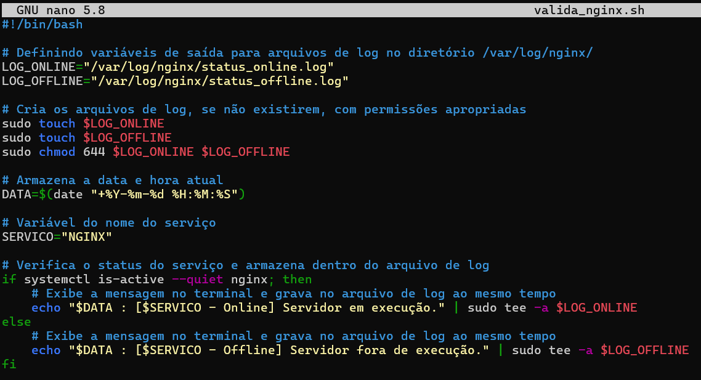
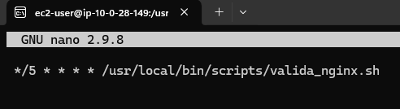
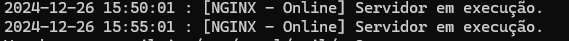

# Projeto: Monitoramento Nginx - Compass UOL | Atividade Prática 1 #PB - NOV 2024 | DevSecOps

# Índice

- [Descrição](#descrição)
- [Parte 1: Instalação do WSL no Windows](#parte-1-instalação-do-wsl-no-windows)
  - [Ativar o Subsistema do Windows para Linux](#1-ativar-o-subsistema-do-windows-para-linux)
  - [Instalar o WSL](#2-instalar-o-wsl)
  - [Instalar o Ubuntu pela Microsoft Store](#3-instalar-o-ubuntu-pela-microsoft-store)
- [Parte 2: Configurar ambiente AWS](#parte-2-configurar-ambiente-aws)
  - [Criar a VPC](#1-criar-a-vpc)
  - [Configurar os parâmetros da VPC](#2-configurar-os-parâmetros-da-vpc)
  - [Finalizar a criação](#3-finalizar-a-criação)
  - [Criar o Grupo de Segurança](#4-criar-o-grupo-de-segurança)
  - [Criar Instância EC2](#5-criar-instância-ec2)
  - [Conectar à Instância EC2 via SSH](#6-conectar-à-instância-ec2-via-ssh)
- [Parte 3: Instalando e configurando o Nginx](#parte-3-instalando-e-configurando-o-nginx)
  - [Atualização do Sistema](#1-atualização-do-sistema)
  - [Instalando o Nginx](#2-instalando-o-nginx)
  - [Verificando o Status do Nginx](#3-verificando-o-status-do-nginx)
  - [Habilitar o Nginx para iniciar automaticamente](#4-habilitar-o-nginx-para-iniciar-automaticamente)
  - [Acessando o Nginx](#5-acessando-o-nginx)
- [Parte 4: Criação do Script de Verificação](#parte-4-criação-do-script-de-verificação)
  - [Acessando o diretório de logs do Nginx e alterando permissões](#1-acessando-o-diretório-de-logs-do-nginx-e-alterando-permissões)
  - [Criando o diretório para armazenar o Script](#2-criando-o-diretório-para-armazenar-o-script)
  - [Criando o Script de verificação](#3-criando-o-script-de-verificação)
  - [Inserindo o código no arquivo](#4-inserindo-o-código-no-arquivo)
  - [Deixando o script executável](#5-deixando-o-script-executável)
- [Parte 5: Automatizando o Script](#parte-5-automatizando-o-script)
  - [Instalar o pacote cron](#1-instalar-o-pacote-cron)
  - [Ativar o serviço cron para iniciar automaticamente no boot](#2-ativar-o-serviço-cron-para-iniciar-automaticamente-no-boot)
  - [Iniciar o serviço cron](#3-iniciar-o-serviço-cron)
  - [Editando o arquivo de tarefas agendadas do cron](#4-editando-o-arquivo-de-tarefas-agendadas-do-cron)
  - [Adicionando a linha no cron para execução a cada 5 minutos](#5-adicionando-a-linha-no-cron-para-execução-a-cada-5-minutos)
  - [Salvando e saindo do editor](#6-salvando-e-saindo-do-editor)
- [Parte 6: Testando](#parte-6-testando)
  - [Verificando os arquivos de log](#1-verificando-os-arquivos-de-log)
- [Bônus](#bônus)
- [Referências](#referências)

## **Descrição**

Configurar um servidor Nginx online no Linux e criar um script para verificar seu status, registrando os resultados em arquivos de saída distintos (ONLINE ou OFFLINE) com data, hora e nome do serviço. O script será automatizado para rodar a cada 5 minutos. O projeto será versionado no GitHub e a documentação explicará o processo de instalação e configuração.


## Estrutura do projeto


## **Parte 1: Instalação do WSL no Windows**

### **1. Ativar o Subsistema do Windows para Linux**
1. Abra o **Painel de Controle**.
2. Acesse **Programas** > **Programas e Recursos** > **Ativar ou desativar recursos do Windows**.
3. Habilite a opção **Subsistema do Windows para Linux**.
4. Clique em **OK** e reinicie o computador para aplicar as alterações.

### **2. Instalar o WSL**
1. Abra o **PowerShell** como administrador:
2. Execute o comando abaixo para instalar o WSL:
   ```powershell
   wsl --install

### **3. Instalar o Ubuntu pela Microsoft Store**
1. Abra a **Microsoft Store**:
2. Pesquise por **Ubuntu** 
3. Clique em **Instalar** para adicionar a distribuição ao seu sistema.
   
---

## **Parte 2: Configurar ambiente AWS**

### **1. Criar a VPC**
1. Faça login na sua conta AWS.
2. No painel principal, vá até **Serviços** e selecione **VPC**.
3. Clique no botão **Criar VPC**.
4. Na próxima tela, selecione a opção **VPC e muito mais**.

### **2. Configurar os parâmetros da VPC**
Preencha os campos conforme indicado abaixo:

- **Nome da VPC**: Insira um nome descritivo, como `minha-vpc`.
- **Número de zonas de disponibilidade**: **2** (mantenha o padrão).
- **Número de sub-redes públicas**: **2**.
- **Número de sub-redes privadas**: **0**. (nesse projeto não utilizaremos sub-redes privadas)
- **NAT Gateways**: **Nenhum**.
- **Endpoints da VPC**: **Nenhum**.

### **3. Finalizar a criação**
1. Revise as configurações para garantir que estão corretas.
2. Clique no botão **Criar VPC**.
3. Aguarde o processo de criação ser concluído.

### 4. Criar o Grupo de Segurança

1. **Acesse o Console de EC2** e vá para **Security Groups**.
2. **Crie um novo grupo**:
   - **Nome**: Dê um nome para o seu grupo de segurança
   - **Descrição**: `Grupo de segurança para controlar tráfego da EC2`
   - **Vincule à VPC** criada.
3. **Adicionar Regras de Entrada**:
   - **SSH (porta 22)**: 
     - Fonte: `0.0.0.0/0` (acesso SSH de qualquer IP)
   - **HTTP (porta 80)**: 
     - Fonte: `0.0.0.0/0` (acesso HTTP público)
4. **Adicionar Regras de Saída**:
   - **Todo o tráfego**: 
     - Destino: `0.0.0.0/0` (permite tráfego de saída irrestrito)
5. **Revisar e Criar**.

Esse processo garante que sua instância EC2 esteja acessível para administração e web, enquanto possibilita comunicação externa.

### 5. Criar Instância EC2

1. **Acesse o Console da AWS** e vá para a seção **EC2** e clique em **Launch Instance** para iniciar o processo de criação.
2. **Escolher a AMI**: Selecione **Amazon Linux 2023 AMI** 
3. **Escolher o Tipo de Instância**: Selecione uma instância de tipo `t2.micro` (nível gratuito)
4. Crie um par de chaves **RSA** em formato **.pem**
5. **Configurações de rede**:
   - Selecione a **VPC** criada anteriormente.
   - Selecione a **Sub-rede** e **atribua Ip público automaticamente**.
   - Selecione o **grupo de segurança** criado anteriormente.
6. **Armazenamento**: O armazenamento padrão de **8 GB** é suficiente.
7. Clique em **Executar instância**
   
### 6. Conectar à Instância EC2 via SSH

1. **Prepare a Chave Privada**
   No terminal, defina permissões para a chave privada:
   
     ```bash
     chmod 400 "sua-chave-privada.pem"
     ```

3. **Conectar via SSH**
   Execute o comando abaixo, substituindo o caminho para a chave privada e o DNS público da sua instância:
   
     ```bash
     ssh -i "caminho-para-sua-chave.pem" ec2-user@seu-endereco-publico-ec2
     ```
---

## Parte 3. Instalando e configurando o Nginx

### 1. **Atualização do Sistema**
   Primeiro, atualize a lista de pacotes e atualize os pacotes instalados para a versão mais recente:
     
   ```bash
   sudo yum update && sudo yum upgrade -y
   ```

### 2. **Instalando o Nginx**
   ```
   sudo yum install nginx -y
   ```

### 3. **Verificando o Status do Nginx**
   Se o Nginx estiver em execução, você verá uma saída indicando que o serviço está ativo (running).
     
   ```
   systemctl status nginx
   ```
   

   Caso contrário, você pode iniciar o serviço com o comando:
     
   ```
   sudo systemctl start nginx
   ```

### 4. **Habilitar o Nginx para iniciar automaticamente**
   ```
   sudo systemctl enable nginx
   ```

### 5. **Acessando o Nginx**

  Após a instalação e ativação do Nginx, você pode acessar a página inicial do Nginx no navegador, digitando o endereço IP público da sua instância EC2 na barra de endereços.
  
  

---

## Parte 4. Criação do Script de Verificação

### 1. **Acessando o diretório de logs do Nginx e alterando permissões**

   ```bash
   sudo chmod 755 /var/log/nginx
   ```

### 2. **Criando o diretório para armazenar o Script**
   Por boas práticas, scripts que têm impacto global no sistema devem ser armazenados em /usr/local/bin.
       
   ```bash
   sudo mkdir -p /usr/local/bin/scripts && cd /usr/local/bin/scripts
   ```

### 3. **Criando o Script de verificação**

   ```bash
   sudo nano valida_nginx.sh
   ```

### 4. **Inserindo o código no arquivo**

```bash

#!/bin/bash

# Definindo variáveis de saída para arquivos de log no diretório /var/log/nginx/
LOG_ONLINE="/var/log/nginx/status_online.log"
LOG_OFFLINE="/var/log/nginx/status_offline.log"

# Cria os arquivos de log, se não existirem, com permissões apropriadas
sudo touch $LOG_ONLINE
sudo touch $LOG_OFFLINE
sudo chmod 644 $LOG_ONLINE $LOG_OFFLINE

# Armazena a data e hora atual
DATA=$(date "+%Y-%m-%d %H:%M:%S")

# Variável do nome do serviço
SERVICO="NGINX"

# Verifica o status do serviço e armazena dentro do arquivo de log
if systemctl is-active --quiet nginx; then
    # Exibe a mensagem no terminal e grava no arquivo de log ao mesmo tempo
    echo "$DATA : [$SERVICO - Online] Servidor em execução." | sudo tee -a $LOG_ONLINE
else
    # Exibe a mensagem no terminal e grava no arquivo de log ao mesmo tempo
    echo "$DATA : [$SERVICO - Offline] Servidor fora de execução." | sudo tee -a $LOG_OFFLINE
fi

```


Salve o arquivo (Ctrl + X,  Y,  Enter)
   
### 5. **Deixando o script executável**

```bash
sudo chmod +x valida_nginx.sh
```

---

## Parte 5. Automatizando o Script

Vamos configurar a execução automática do script a cada 5 minutos utilizando o **cron**.

### 1. **Instalar o pacote `cron`**

O **cron** não está instalado no **Amazon Linux 2** por padrão. Para instalá-lo, execute o seguinte comando:

```bash
sudo yum install cronie
```

### 2. **Ativar o serviço `cron` para iniciar automaticamente no boot:**

```bash
sudo systemctl enable crond
```

### 3. **Iniciar o serviço `cron`:**

```bash
sudo systemctl start crond
```

### 4. **Editando o arquivo de tarefas agendadas do cron**

Abra o editor para editar o arquivo de tarefas agendadas do cron:

```bash
sudo crontab -e
```

### 5. **Adicionando a linha no cron para execução a cada 5 minutos**
  
```bash
 */5 * * * * /usr/local/bin/scripts/valida_nginx.sh
```



O */5 * * * * no cron é uma expressão que define a frequência de execução do comando. Ela é dividida em cinco campos:


### 6. **Salvando e saindo do editor**
Salve o arquivo apertando ESC e depois digite **:wq**

---

## Parte 6. Testando

### 1. **Verificando os arquivos de log**
Verifique os arquivos de log no diretório /var/log/nginx

```bash
cat /var/log/nginx/status_online.log
```



```bash
cat /var/log/nginx/status_offline.log
```


### Agora o script está configurado e será executado automaticamente a cada 5 minutos, registrando o status do serviço Nginx.


# Bônus 

## Verificação Automática do Status do Nginx no Docker

Vamos refazer o projeto utilizando **Docker** e **User Data** para aproveitar seus benefícios: o Docker garante portabilidade e isolamento ao executar o Nginx em um contêiner, enquanto o User Data automatiza a instalação e configuração do ambiente durante a inicialização da instância, reduzindo erros manuais e agilizando o processo.

## Parte 1. Inserindo código userdata

Na criação da Instância EC2, clique em **Detalhes avançados** e no campo **Dados do usuário** insira o código abaixo

```bash
#!/bin/bash
# Atualizar pacotes
sudo yum update -y

# Instalar Docker
sudo amazon-linux-extras enable docker
sudo yum install -y docker
sudo systemctl enable docker
sudo systemctl start docker

# Iniciar container Nginx
sudo docker run -d --name nginx-container -p 80:80 nginx

# Criar diretório para scripts dentro da instância
sudo mkdir -p /usr/local/bin/scripts
sudo chmod 755 /usr/local/bin/scripts

# Criar script de validação de logs
cat <<EOL > /usr/local/bin/scripts/valida_nginx.sh
#!/bin/bash

# Diretórios de logs no container
LOG_ONLINE="/var/log/nginx/status_online.log"
LOG_OFFLINE="/var/log/nginx/status_offline.log"

# Armazena data e hora atual
DATA=\$(date "+%Y-%m-%d %H:%M:%S")

# Verifica se o container Nginx está em execução
CONTAINER="nginx-container"
if sudo docker ps --filter "name=\$CONTAINER" --filter "status=running" | grep -q \$CONTAINER; then
    sudo docker exec \$CONTAINER sh -c "echo '\$DATA : [Nginx Online] Servidor em execução.' >> \$LOG_ONLINE"
    
else
    sudo docker exec \$CONTAINER sh -c "echo '\$DATA : [Nginx Offline] Servidor parado.' >> \$LOG_OFFLINE"
    
fi
EOL

# Deixar o script executável
sudo chmod +x /usr/local/bin/scripts/valida_nginx.sh

# Instalar cron para automatizar execução
sudo yum install -y cronie
sudo systemctl enable crond
sudo systemctl start crond

# Configurar cron para rodar o script a cada 5 minutos
echo "*/5 * * * * /usr/local/bin/scripts/valida_nginx.sh" | sudo tee -a /var/spool/cron/root


```


O **User Data** permite automatizar a configuração e execução de scripts ou comandos durante a inicialização de uma instância EC2, facilitando a instalação e configuração de software sem a necessidade de intervenção manual.


```bash
sudo docker exec nginx-container cat /var/log/nginx/status_online.log
```


```bash
sudo docker exec nginx-container cat /var/log/nginx/status_offline.log
```


## Comandos Adicionais

Depois de rodar o script, você pode utilizar os seguintes comandos para gerenciar o container do Nginx:

**Verificar containers em execução:**

```bash
sudo docker ps
```

**Parar o container Nginx:**

```bash
sudo docker stop nginx-container
```

**Iniciar novamente o container Nginx:**

```bash
sudo docker start nginx-container
```

## Referências

1. [Docker Documentation](https://docs.docker.com/) - Documentação oficial do Docker, fornecendo informações detalhadas sobre instalação, configuração e uso de containers.
2. [AWS EC2 User Data Documentation](https://docs.aws.amazon.com/AWSEC2/latest/UserGuide/user-data.html) - Explica como usar o User Data para automatizar a configuração e execução de scripts em instâncias EC2.
3. [Nginx Official Documentation](https://nginx.org/en/docs/) - Documentação oficial do Nginx, oferecendo detalhes sobre instalação, configuração e uso.
4. [Cron Syntax and Usage](https://man7.org/linux/man-pages/man5/crontab.5.html) - Guia de sintaxe e uso do cron para agendar tarefas no Linux.
5. [Amazon EC2 Documentation](https://docs.aws.amazon.com/ec2/) - Guia oficial para trabalhar com instâncias EC2, incluindo criação, configuração e gerenciamento.
6. [Installing Nginx using AWS EC2 User Data - Medium](https://medium.com/sai-ops/installing-nginx-using-aws-ec2-user-data-5590fdbe528d) - Artigo explicando como instalar e configurar o Nginx em uma instância EC2 usando o User Data.
7. [YouTube - Como lançar uma EC2 com Docker na AWS](https://www.youtube.com/watch?v=rYWjsOWGmxU&t=747s) - Vídeo explicando como utilizar o User Data do AWS EC2 para automatizar a instalação e configuração de serviços em instâncias EC2.


